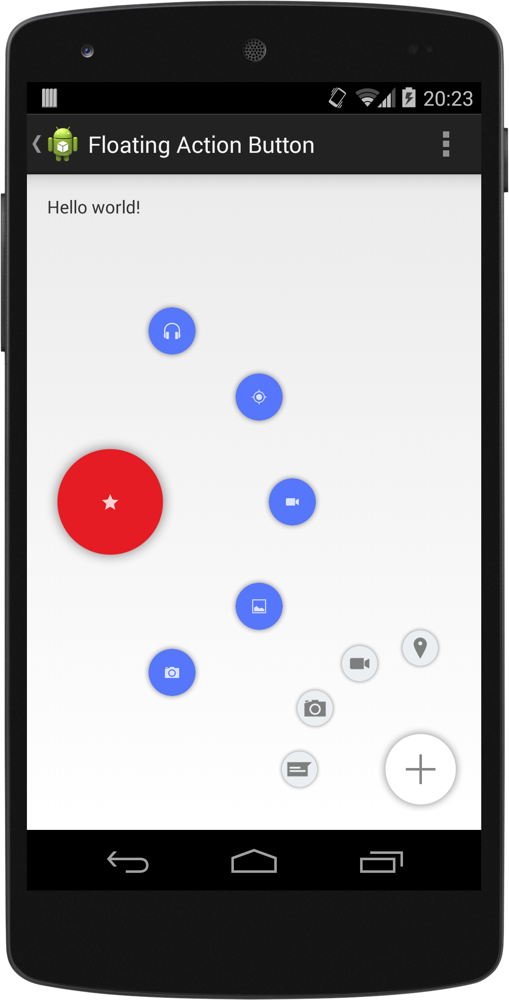
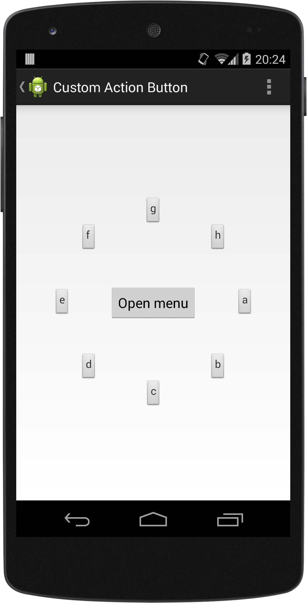

# CircularFloatingActionMenu


An animated, customizable circular floating menu for Android, inspired by Path app.

## Getting Started
### Requirements
- API >= 15

### Installation
Grab the AAR from Maven Central by adding it as a dependency in your **build.gradle** file:

```groovy
dependencies {
    compile 'com.oguzdev:CircularFloatingActionMenu:1.0.2'
}
```
Alternatively, clone the repo and add `library` as a module to your project.

### Usage
CircularFloatingActionMenu can be attached to **any view** in your layout. A Floating Action Button implementation is available in the library, with a similar look to new Material Design's FAB. 

1 - Create a button to attach the menu:
	
```java
// in Activity Context
ImageView icon = new ImageView(this); // Create an icon
icon.setImageDrawable( ... );
	
FloatingActionButton actionButton = new FloatingActionButton.Builder(this)
										.setContentView(icon)
										.build();
	
```

2 - Create menu items:

```java
SubActionButton.Builder itemBuilder = new SubActionButton.Builder(this);
// repeat many times:
ImageView itemIcon = new ImageView(this);
itemIcon.setImageDrawable( ... ); 
SubActionButton button1 = itemBuilder.setContentView(itemIcon).build();
 
```

3 - Create the menu with the items:

```java
FloatingActionMenu actionMenu = new FloatingActionMenu.Builder(this)
									.addSubActionView(button1)
									.addSubActionView(button2)
									// ...
									.attachTo(actionButton)
									.build();
```
And you're ready to go!

## Customization
**Animations**, **start angle**, **end angle** and **radius** are customizable via `FloatingActionMenu.Builder`.

`FloatingActionMenu` is the essential class for the menu. Other two classes, `FloatingActionButton` and `SubActionButton` are just **views** and they can be replaced with any other view. You are completely free to create your own menu button and item views.

Existing `FloatingActionButton` and `SubActionButton` views are customizable too. These parameters can be changed via Builders of both classes:

- Theme (Light / Dark)
- Background drawable
- LayoutParams (width & height)
- Content View

`FloatingActionButton` can be placed to one of **8 predefined positions** on the screen. To place it somewhere else, extend it!




### Custom Animations
You can write your own animation handler class by extending from `MenuAnimationHandler` to completely customize menu opening and closing animations.

Then all you need is to create an instance of your custom animation handler and pass it to `FloatingActionMenu.Builder` via `setAnimationHandler( )` method.

See `CustomAnimationHandler` in **samples** module for a sample animation handler.

## Licence
CircularFloatingActionMenu is released under MIT Licence. See file LICENCE.
